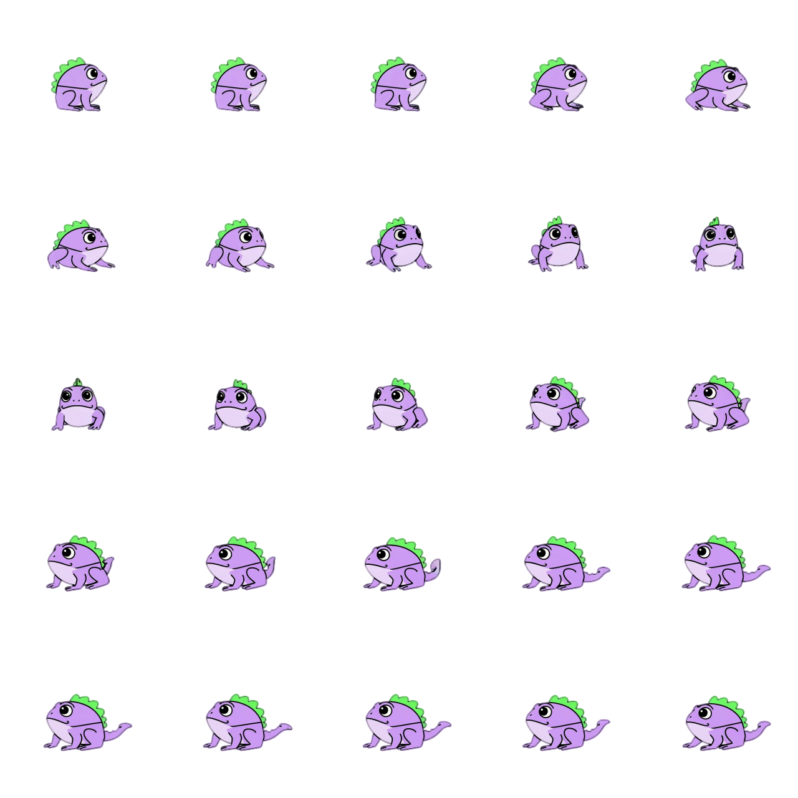
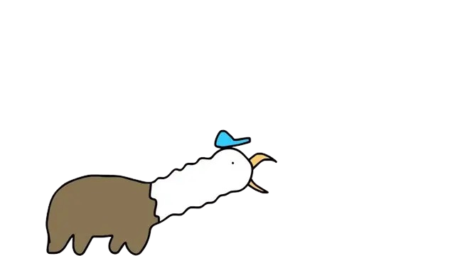

# RopuchAdventure

RopuchAdventure is a 2D platformer made in Unity for a videogame programming exam project. 
The game follows Ropuch, Gryfica Gnilda (ta ździra) and Dziunia in a simple action setup where the player controls Ropuch, fights enemies (gryfy), and progresses through the level while avoiding damage and using jumps and attacks at the right time.

The characters are based on the YouTube series "Kuce z bronksu". The same inspiration was also used for the audio, start screen, and end screen, so the whole project keeps that recognizable style.

## Main Characters

- Ropuch - the player character. He can move, jump, attack, and shoot bullets.
- Dziunia - an enemy character with automatic shooting behavior and a limited number of lives.
- Gryfica Gnilda- an enemy that can take damage from bullets and disappear after enough hits.

## Character Images

| Character | Preview |
|---|---|
| Ropuch |  |
| Dziunia |  |
| Gryfica Gnilda |  |

Character spritesheets for the main cast (Ropuch, Dziunia, and Gryfica Gnilda) were AI-generated and then adapted for this project.

## Gameplay

- Move through the level as Ropuch.
- Jump across platforms and avoid hazards.
- Use attacks and bullets to deal with enemies.
- Survive enemy contact and projectiles.
- Reach the end of the level and complete the stage.

## Controls

- `A` / `D` or horizontal input - move left and right.
- `Space` - jump.
- `Return` - attack / shoot, depending on the active character logic.

## Project Notes

- Built in Unity.
- Uses custom scripts for player movement, enemy behavior, bullets, and hit effects.
- Start and end screens, along with the audio, are themed around "Kuce z bronksu".

## Imported Assets, Sources, and Licenses

### Art, VFX, and Audio Packs

| Imported content | Repository location | Source | License |
|---|---|---|---|
| Enchanted World Music Pack | `Assets/Enchanted World Music Pack` | Third-party imported music pack (original download source should be the asset page used during import) | Original pack license terms (not bundled as a separate license file in this repository) |
| Hits Effects FREE (Matthew Guz) | `Assets/Matthew Guz/Hits Effects FREE` | Matthew Guz (contact listed in included readme: `mattvg923@gmail.com`) | Follow the original distribution terms for this pack (see `Assets/Matthew Guz/Hits Effects FREE/Documentation/Readme IMPORTANT.txt`) |
| 2D Pixel Art Platformer Biome - American Forest | `Assets/Resources/Images/2D Pixel Art Platformer Biome - American Forest` | Third-party imported biome pack | See bundled `ReadMe.pdf` in this folder for source/license terms |
| 2D Pixel Art Platformer Biome - Plains | `Assets/Resources/Images/2D Pixel Art Platformer Biome - Plains` | Third-party imported biome pack | See bundled `ReadMe.pdf` in this folder for source/license terms |
| PlatformerTileset | `Assets/PlatformerTileset` | Third-party imported tileset pack | Use the original pack license terms from the source where it was downloaded |

### Imported .NET / NuGet Packages

Packages listed in `Assets/packages.config` are imported from NuGet and include license metadata in their `.nuspec` files:

| Package | Version | Source | License |
|---|---|---|---|
| Microsoft.Bcl.AsyncInterfaces | 10.0.8 | https://dot.net/ | MIT |
| Microsoft.Extensions.DependencyInjection | 10.0.8 | https://dot.net/ | MIT |
| Microsoft.Extensions.DependencyInjection.Abstractions | 10.0.8 | https://dot.net/ | MIT |
| System.IO.Pipelines | 10.0.8 | https://dot.net/ | MIT |
| System.Runtime.CompilerServices.Unsafe | 6.1.2 | https://github.com/dotnet/maintenance-packages | MIT |
| System.Text.Encodings.Web | 10.0.8 | https://dot.net/ | MIT |
| System.Text.Json | 10.0.8 | https://dot.net/ | MIT |

### Unity Packages

Unity packages are listed in `Packages/manifest.json` and are imported through the Unity Package Manager (Unity Registry). Their usage is governed by Unity package and editor licensing terms.

## Credits

- Game concept and implementation: RopuchAdventure project by Zuzanna Mysłek.
- Character, audio, and screen inspiration: "Kuce z bronksu" YouTube series.
